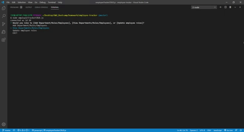

# Employee-Tracker
Employee-Tracker is a node application that allows the creation of a database for companies.
The database is seeded with data.
Departments, roles, and employees are creatable and viewable within the application.
Roles are also able to be revised and edited.
Manager column is also available to denote which employees are managers.
Application utilizes dotENV to keep your password safe.

## Technologies Used
* Inquirer
* mySQL
* dotENV
* console.table

## Demo

